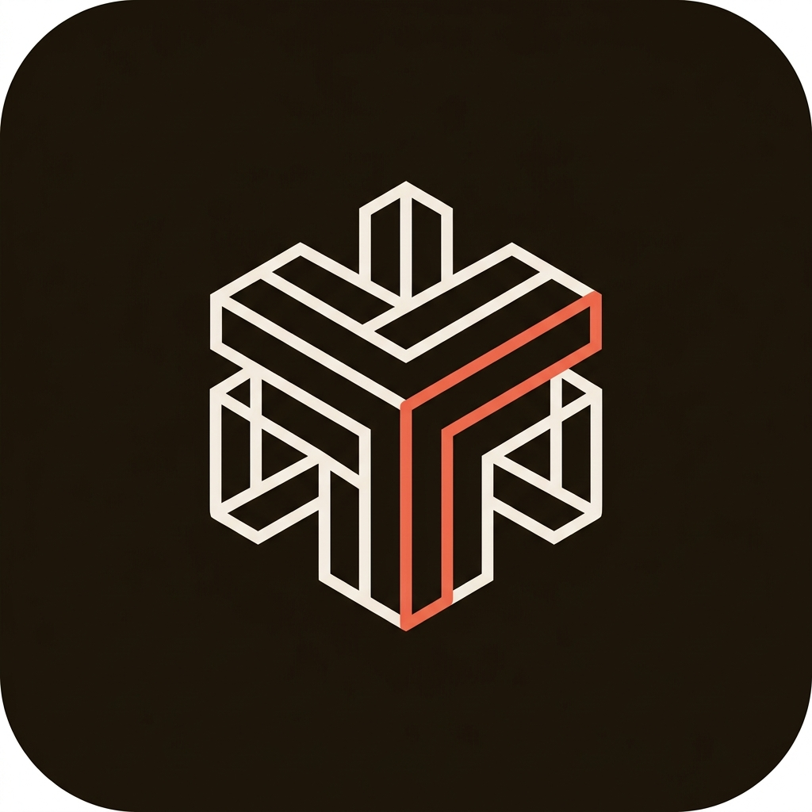

<div align="center">



# Eixo

### Acompanhamento Transparente de Obras & Decisões Bilaterais

[](https://reactjs.org/)
[](https://www.typescriptlang.org/)
[](https://vitejs.dev/)
[](https://phosphoricons.com/)
[](LICENSE)

*Mantenha sua obra no eixo: do primeiro traço à entrega das chaves, com alinhamento milimétrico entre construtor e cliente.*

</div>

---

## 🎯 Por que o Eixo existe?

Na construção civil e em reformas, as obras não saem do eixo por falhas na alvenaria, mas por **ruídos de comunicação**, acordos verbais perdidos em conversas de WhatsApp, decisões de acabamento sem registro e falta de previsibilidade para o cliente final.

O **Eixo** resolve essa dor ao unir em uma interface executiva e descomplicada:
1. **Cronograma Físico Visual** com evidências fotográficas em tempo real.
2. **Central de Decisões com Assinatura Digital Bilateral**, eliminando disputas e retrabalho.
3. **Controle de Perfis (Construtor vs. Cliente)** com link seguro de acompanhamento em modo leitura.

---

## ✨ Funcionalidades Principais

### ✍️ Central de Decisões & Assinatura Digital Bilateral
- **Mecânica de Aceite Construtor-Cliente**: qualquer alteração de projeto, escolha de revestimento ou aditivo de prazo/custo pode ser proposta por qualquer uma das partes.
- **Validação Formal**: quem cria a decisão assina no ato; a contraparte analisa e pode **Concordar e Assinar** ou **Recusar / Solicitar Ajuste**.
- **Carimbo Auditável**: uma vez aprovada, a decisão exibe o selo digital com nome, perfil e data/hora exatos de ambas as assinaturas.
- **Timeline Cronológica**: visão sequencial de decisões com espinha vertical e contador de pendências em tempo real na barra de navegação.

### 🧱 Cronograma Físico & Wizard de Etapas
- **Wizard Passo a Passo**: criação intuitiva de etapas técnicas pré-configuradas (proteção, fundação, alvenaria, elétrica/hidráulica, revestimento, pintura, entrega).
- **Ícones Temáticos Dedicados**: cada etapa técnica possui um ícone Phosphor contextualizado com container de cor correspondente.
- **Drag & Drop Intuitivo**: reordenação ágil de etapas e serviços pelo pegador `⋮⋮`.
- **Rastreabilidade Temporal**: registro automático de carimbo de data e hora de conclusão (`concluidaEm`) em etapas e serviços.

### 👥 Controle de Acesso & Link do Cliente
- **Perfil Construtor**: gestão técnica irrestrita, adição de serviços, reordenação e gestão de decisões.
- **Perfil Cliente (*Read-Only*)**: visualização limpa do avanço e evidências, sem botões destrutivos de exclusão ou edição acidental do planejamento.
- **Compartilhamento por Link**: aba dedicada com cópia rápida de URL com parâmetros de perfil (`?perfil=cliente&obra=ID_DA_OBRA`).

### 📸 Diário de Canteiro & Evidências Visuais
- **Galeria por Tarefa**: upload de fotos comprobatórias do avanço físico e anotações técnicas de campo.
- **Navegação Cruzada**: ao clicar em qualquer evidência ou nota na aba de Anexos, o sistema navega instantaneamente para a tarefa no cronograma, expande o accordion automaticamente e aplica destaque pulsante temporário.

### 🎨 Design System Cardless & Paleta Nobre
- **Estética Profissional**: linhas limpas com divisores sutis (*hairline*), eliminando cartões excessivos.
- **Paleta Terrosa**: tons de café tostado (`dark-coffee`), madeira canela (`cinnamon-wood`) e acento vibrante em coral glow (`coral-glow`).
- **Zero Emojis**: 100% dos ícones utilizam a biblioteca **Phosphor Icons**, garantindo consistência técnica em qualquer plataforma.
- **Sem Alerts Nativos**: todas as confirmações utilizam modais desenvolvidos dentro do design system (`ModalConfirm`).

---

## 🛠️ Tecnologias Utilizadas

- **Core**: [React 18](https://reactjs.org/) + [TypeScript](https://www.typescriptlang.org/)
- **Build Tool**: [Vite](https://vitejs.dev/) (Fast HMR)
- **Iconografia**: [@phosphor-icons/react](https://phosphoricons.com/)
- **Estilização**: CSS Moderno modular baseado em CSS Custom Properties (Design Tokens)
- **Efeitos de Celebração**: [canvas-confetti](https://www.npmjs.com/package/canvas-confetti)
- **Persistência**: LocalStorage com suporte a dados de demonstração integrados

---

## 🚀 Como Executar Localmente

### Pré-requisitos
- Node.js 18+ instalado
- npm ou yarn

### Instalação

```bash
# Clone o repositório
git clone https://github.com/vicctor-b/Eixo.git

# Acesse o diretório
cd Eixo

# Instale as dependências
npm install

# Inicie o servidor de desenvolvimento
npm run dev
```

Abra `http://localhost:5173` no seu navegador.

### Compilação de Produção

```bash
npm run build
```

---

## 📐 Decisões de Arquitetura & UX

Para consultar o histórico detalhado de todas as decisões tomadas no projeto, consulte o arquivo [AGENTS.md](./AGENTS.md).

---

## 📄 Licença

Este projeto é disponibilizado sob a licença MIT. Consulte o arquivo [LICENSE](./LICENSE) para mais detalhes.
